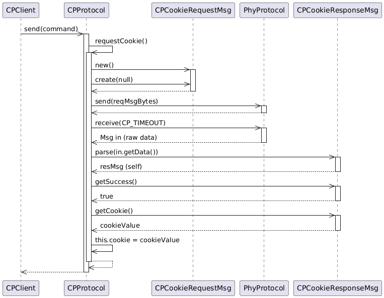

# Cookie-Network-Protocol
 
## **task 1**

**subtask 1.1** - Document protocol stack initialization and the cookie request method all the way until a cookie is available to the client or the request got rejected.

**subtask 1.2** - Completion of client methods:
- Completion of `send()` method in CPProtocol.
    - _create a command message object_
    - _send the message to the server and store it in CPProtocol_
- Implementation of receive method in CPProtocol.
    - _for each command sent the client waits 2s for the server response_
    - _call the message parser to reconstruct the command according to the protocol spec | discard if exception_
    - _check if the response matches the command comparing IDs_
    - _return appropriately_
- Creation and implementation of message classes to create and parse command and command response messages.
    - _calculate checksum using CRC32 library_ (https://docs.oracle.com/javase/9/docs/api/java/util/zip/CRC32.html)
    - _add getters_
 
## **task 2**

**subtask 2.1** - Cookie server implementation:
- enhancement of `receive()` (CPProtocol) to handle cookie requests
    - _dedicated method to process cookie requests_
    - _hash-map with associative array to map the clients to their cookies_ (https://docs.oracle.com/javase/9/docs/api/java/util/HashMap.html)
        -  _phyConfiguration of client used as key to the map, value of the entries represent cookies_
        -  _never more than 20 entries in the hash-map | reject if more_
   - _implementation on processing of premature cookie renewal_
        - _document decision_
   - _implementation of apropriate response messages from server_

